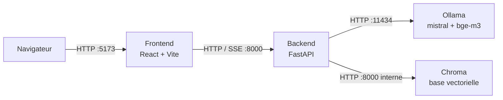

# krole

[](https://github.com/OWNER/krole/actions/workflows/ci.yml)

**Le RAG souverain, 100 % local** — chatbot de génération augmentée par
récupération (RAG) qui tourne entièrement sur votre machine via Docker :
ingestion de documents, recherche hybride, citations au passage près, graphe de
connaissances, mode vocal et évaluation RAGAS, **sans aucun appel cloud**.

Vos documents ne quittent jamais votre machine. Chaque réponse est ancrée dans
vos sources et **vérifiable** : un clic sur une citation `[n]` rouvre le
document à la bonne page, passage surligné. Et la qualité ne se devine pas :
elle se **mesure**, en local, avec RAGAS.

## Fonctionnalités

- **RAG hybride** — recherche vectorielle (bge-m3) + BM25, fusionnées par
  Reciprocal Rank Fusion ; reranking cross-encoder optionnel avec garde-fou de
  pertinence.
- **Citations vérifiables** — chaque affirmation porte un badge `[n]` ; un clic
  ouvre la source (PDF à la bonne page) avec le **passage surligné**.
- **Graphe de connaissances** — entités et relations extraites par LLM,
  visualisées en graphe interactif ; un nœud renvoie aux chunks où il apparaît.
- **Mode vocal 100 % local** — transcription Whisper (faster-whisper) et
  synthèse vocale Piper, hors ligne, sur CPU.
- **Évaluation RAGAS locale** — fidélité, pertinence, précision/rappel du
  contexte ; le juge est **Mistral via Ollama** (aucun appel OpenAI).
- **Streaming SSE** — affichage progressif des réponses, jeton par jeton.
- **Avec / sans RAG** — bascule « Mistral seul » pour montrer le contraste
  entre réponse de mémoire et réponse ancrée dans les sources.
- **Mode debug / Investigation** — étapes du pipeline, candidats scorés
  (vector / BM25 / RRF / rerank), prompt assemblé, latences, token counts.
- **Ingestion multi-formats** — PDF, DOCX, TXT ; chunking avec recouvrement.
- **UI bilingue FR/EN**, thème clair/sombre, réécriture de requête contextuelle.
- **Local-first, cloud optionnel** — génération via Gemini ou Claude **sur
  choix explicite uniquement** ; embeddings et reranking restent locaux.

## Architecture

Quatre services orchestrés par Docker Compose sur un réseau privé (`rag_net`).
Le frontend ne parle qu'au backend ; le backend orchestre Ollama (LLM +
embeddings) et Chroma (base vectorielle).



### Pipeline RAG — deux phases

```mermaid
flowchart TB
    subgraph P1["Phase 1 — Indexation"]
        U["Upload<br/>(PDF / DOCX / TXT)"] --> PARSE["Parsing"]
        PARSE --> CHUNK["Chunking<br/>(800 car., recouvrement 100)"]
        CHUNK --> EMB1["Embeddings bge-m3<br/>(Ollama)"]
        EMB1 --> STORE["Stockage chunks + vecteurs<br/>(Chroma)"]
        CHUNK -.->|optionnel| KG["Extraction entités/relations<br/>→ graphe de connaissances"]
    end

    subgraph P2["Phase 2 — Requête"]
        Q["Question utilisateur<br/>(texte ou voix via Whisper)"] --> RW["Réécriture de requête<br/>(contexte conversationnel)"]
        RW --> EMB2["Embedding de la requête<br/>(bge-m3)"]
        EMB2 --> VEC["Recherche vectorielle<br/>(Chroma)"]
        RW --> BM25["Recherche lexicale<br/>(BM25)"]
        VEC --> RRF["Fusion RRF"]
        BM25 --> RRF
        RRF --> RERANK["Rerank cross-encoder<br/>(optionnel + garde-fou)"]
        RERANK --> PROMPT["Assemblage du prompt<br/>(contexte + question)"]
        PROMPT --> LLM["Génération Mistral<br/>(ou Gemini / Claude)"]
        LLM --> ANSWER["Réponse streamée (SSE)<br/>+ citations [n] → source surlignée<br/>+ TTS Piper optionnel"]
    end
```



## Stack technique

| Couche      | Technologies |
| ----------- | ------------ |
| Backend     | FastAPI (Python 3.11), Pydantic v2, httpx, rank-bm25, FlagEmbedding (reranker), faster-whisper (STT), Piper (TTS), RAGAS |
| Frontend    | React 18, Vite, TypeScript, TailwindCSS, Zustand, React Query v5, react-pdf, react-force-graph-2d, i18next |
| Vector DB   | Chroma (`chromadb/chroma`) |
| LLM runtime | Ollama (`ollama/ollama`) — LLM `mistral`, embeddings `bge-m3` |
| Infra       | Docker Compose (dev et prod), nginx (frontend prod) |

## Prérequis

- **Docker** + Docker Compose v2.
- **~16 Go de RAM** recommandés (Mistral 7B + bge-m3 chargés en mémoire).
- **Pas de GPU nécessaire** : tout tourne sur CPU (les réglages par défaut sont
  optimisés pour la latence CPU).

## Démarrage rapide (dev)

```bash
cp .env.example .env
docker compose up --build -d

# Tirer les modèles dans le conteneur Ollama (une seule fois)
docker exec -it rag_ollama ollama pull mistral
docker exec -it rag_ollama ollama pull bge-m3
```

Puis ouvrir **http://localhost:5173** — glisser-déposer un document dans la
barre latérale, attendre l'indexation, et poser une question.

Vérification : `curl http://localhost:8000/health` → `{"status":"ok"}`.

| Service  | Port hôte | Port interne |
| -------- | --------- | ------------ |
| backend  | 8000      | 8000         |
| frontend | 5173      | 5173         |
| chroma   | 8001      | 8000         |
| ollama   | 11434     | 11434        |

## Variables d'environnement

Toutes les variables ont une valeur par défaut raisonnable — `cp .env.example .env`
suffit pour démarrer. Valeurs ci-dessous = exemples/placeholders.

| Variable | Défaut | Rôle |
| -------- | ------ | ---- |
| `OLLAMA_BASE_URL` | `http://ollama:11434` | URL d'Ollama vue depuis le réseau Docker. |
| `CHROMA_HOST` | `chroma` | Hôte de Chroma (réseau Docker). |
| `CHROMA_PORT` | `8000` | Port interne de Chroma. |
| `MISTRAL_MODEL` | `mistral` | Modèle de génération local (Ollama). |
| `EMBED_MODEL` | `bge-m3` | Modèle d'embeddings (Ollama). |
| `LLM_PROVIDER` | `mistral` | Moteur de **génération** : `mistral` (local), `gemini` ou `claude`. Choix **explicite** : une clé renseignée ne bascule jamais le moteur toute seule. |
| `GEMINI_API_KEY` | *(vide)* | Clé API Google Gemini — requise **uniquement** si `LLM_PROVIDER=gemini`. Ex. : `votre-clé-gemini`. |
| `ANTHROPIC_API_KEY` | *(vide)* | Clé API Anthropic — requise **uniquement** si `LLM_PROVIDER=claude`. Ex. : `sk-ant-...`. |
| `GEMINI_MODEL` | `gemini-2.5-flash` | Modèle Gemini utilisé si le fournisseur est `gemini`. |
| `CLAUDE_MODEL` | `claude-opus-4-8` | Modèle Claude utilisé si le fournisseur est `claude`. |
| `NUM_THREAD` | `8` | Threads d'inférence Ollama = nombre de cœurs **physiques** de la machine. |
| `NUM_CTX` | `2048` | Taille de contexte Ollama (borne l'empreinte mémoire). |
| `KEEP_ALIVE` | `30m` | Durée pendant laquelle Ollama garde le modèle chargé en RAM. |
| `K_CANDIDATES` | `8` | Candidats récupérés (vector + BM25) avant fusion/rerank. |
| `TOP_K` | `4` | Blocs gardés après rerank (affichés comme sources). |
| `CONTEXT_K` | `3` | Blocs réellement injectés dans le prompt (≤ `TOP_K`). |
| `CONTEXT_CHAR_CAP` | `500` | Plafond de caractères par bloc injecté (borne le temps d'évaluation CPU). |
| `NUM_PREDICT` | `96` | Longueur max de génération (tokens) — réponses courtes et ancrées. |
| `RERANK_ENABLED` | `false` | Active le rerank cross-encoder (+ garde-fou de pertinence). Coût : ~20 s/requête et ~2,3 Go de RAM. |
| `RERANK_MODEL` | `BAAI/bge-reranker-v2-m3` | Modèle de reranking (HuggingFace, mis en cache localement). |
| `RERANK_THRESHOLD` | `0.3` | Score minimal (0–1) pour répondre ; en dessous, le bot dit ne pas savoir. |
| `REWRITE_NUM_PREDICT` | `32` | Budget de tokens pour la réécriture de requête. |
| `STT_MODEL` | `small` | Modèle Whisper (faster-whisper) pour la transcription. |
| `STT_COMPUTE_TYPE` | `int8` | Quantification Whisper sur CPU. |
| `STT_LANGUAGE` | *(vide)* | Langue forcée de transcription (ex. `fr`) ; vide = détection automatique. |
| `TTS_VOICE` | `fr_FR-siwis-medium` | Voix Piper pour la synthèse vocale. |
| `EVAL_JUDGE_MODEL` | `mistral` | Juge RAGAS (local, via Ollama — aucun appel OpenAI). |
| `EVAL_JUDGE_NUM_PREDICT` | `256` | Budget de tokens du juge par verdict. |
| `EVAL_NUM_CTX` | `4096` | Contexte du juge RAGAS. |
| `EVAL_METRIC_TIMEOUT` | `300` | Délai max (s) par métrique et par question avant de l'ignorer. |
| `VITE_API_BASE_URL` | `http://localhost:8000` | URL du backend **vue du navigateur** (build frontend). |

## Fournisseurs cloud (optionnel)

krole est **local-first** : par défaut (`LLM_PROVIDER=mistral`), aucune requête
ne sort de la machine. Pour comparer avec un modèle cloud — étape de
**génération uniquement** :

```bash
# .env
LLM_PROVIDER=gemini          # ou: claude
GEMINI_API_KEY=votre-clé     # ou: ANTHROPIC_API_KEY=sk-ant-...
```

Règles de conception :

- Le choix est **explicite** : renseigner une clé ne bascule jamais le moteur
  tout seul.
- Fournisseur cloud choisi sans clé → avertissement au démarrage + **repli sur
  Mistral local**.
- Les **embeddings (bge-m3) et le reranking restent 100 % locaux** dans tous
  les cas : seuls le prompt final et la question partent vers le cloud, jamais
  le corpus.

## Build de production

```bash
docker compose -f docker-compose.prod.yml up -d --build

# Une seule fois : tirer les modèles
docker exec -it rag_ollama ollama pull mistral
docker exec -it rag_ollama ollama pull bge-m3
```

Différences avec le mode dev : image backend figée (pas de montage du code),
frontend compilé et servi statiquement par **nginx** (gzip + fallback SPA),
`restart: unless-stopped`, volumes persistants pour les modèles, la base
vectorielle et les uploads. `VITE_API_BASE_URL` doit pointer vers l'URL du
backend **atteignable par le navigateur**.

## Souveraineté & confidentialité

- **Aucune dépendance cloud par défaut** : LLM, embeddings, reranking, STT,
  TTS et même le juge d'évaluation tournent sur votre machine.
- **Vos documents ne sortent jamais** : ingestion, indexation et recherche sont
  locales ; même en mode cloud optionnel, seul le prompt final est envoyé.
- **Hors ligne** : une fois les modèles tirés, krole fonctionne sans connexion
  Internet.
- **Auditable** : mode debug exposant prompt, chunks scorés et latences ;
  qualité mesurée localement par RAGAS — la confiance ne repose pas sur une
  boîte noire distante.

Pertinent pour les contextes où la donnée est sensible : juridique, santé,
défense, R&D, ou toute organisation soumise à des exigences de localisation
des données (RGPD, secret professionnel).

## Démo

Le script de présentation guidée (~10 min) est dans [DEMO.md](DEMO.md).

## Captures d'écran

> _À venir — placez les captures dans `docs/screenshots/`._

| Vue | Aperçu |
| --- | ------ |
| Chat avec citations `[n]` → source surlignée | _capture à ajouter_ |
| Graphe de connaissances interactif | _capture à ajouter_ |
| Panneau Investigation (mode debug) | _capture à ajouter_ |
| Évaluation RAGAS | _capture à ajouter_ |

## Licence

[MIT](LICENSE)
